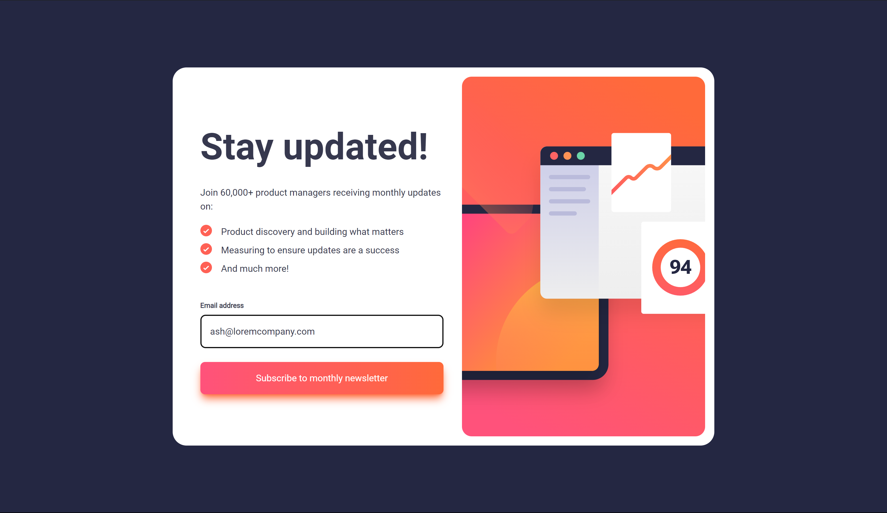
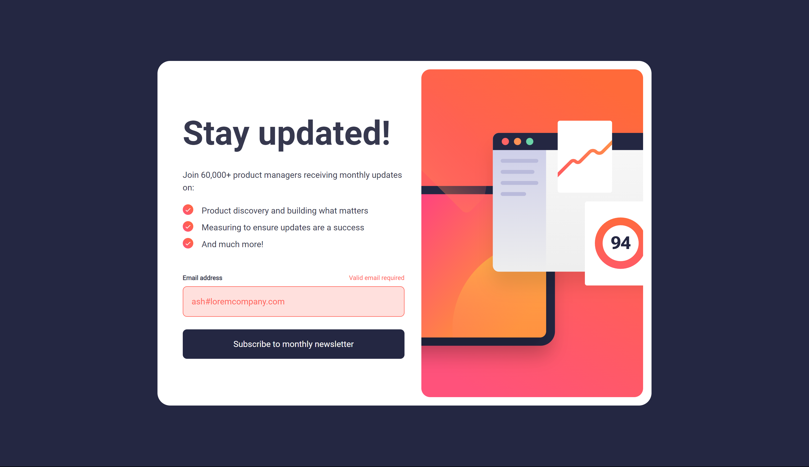
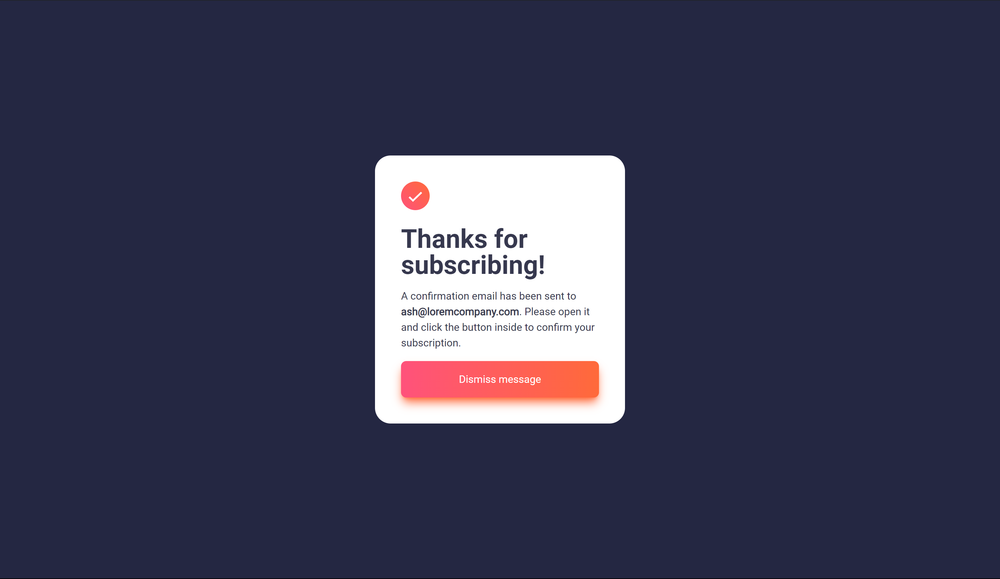

# Frontend Mentor - Newsletter sign-up form with success message solution

This is a solution to the [Newsletter sign-up form with success message challenge on Frontend Mentor](https://www.frontendmentor.io/challenges/newsletter-signup-form-with-success-message-3FC1AZbNrv). Frontend Mentor challenges help you improve your coding skills by building realistic projects. 

## Table of contents

- [Overview](#overview)
  - [The challenge](#the-challenge)
  - [Screenshot](#screenshot)
  - [Links](#links)
- [My process](#my-process)
  - [Built with](#built-with)
  - [What I learned](#what-i-learned)
  - [Continued development](#continued-development)
- [Author](#author)

## Overview

### The challenge

Users should be able to:

- Add their email and submit the form
- See a success message with their email after successfully submitting the form
- See form validation messages if:
  - The field is left empty
  - The email address is not formatted correctly
- View the optimal layout for the interface depending on their device's screen size
- See hover and focus states for all interactive elements on the page

### Screenshot

### Links

- Solution URL: [GitHub](https://your-solution-url.com)
- Live Site URL: [Netlify](https://your-live-site-url.com)

## My process

### Built with

- Semantic HTML5 markup
- Flexbox
- Mobile-first workflow
- [React](https://reactjs.org/) - TypeScript
- [Tailwind CSS](https://styled-components.com/) - For styles
- [Vite](https://vitejs.dev/) - For development environment
- [Zod](https://zod.dev/) - For form validation
- [react-hook-form](https://react-hook-form.com/)
- [@hookform/resolvers](https://www.npmjs.com/package/@hookform/resolvers/v/1.3.7)

**Note: These are just examples. Delete this note and replace the list above with your own choices**

### What I learned

I learned how to create and handle forms as well as state management.

### Continued development

I would like to look into react portals to render components outside the tree hierarchy.

## Author

- GitHub - [rawrisotto](https://github.com/rawrisotto)
- Frontend Mentor - [@rawrisotto](https://www.frontendmentor.io/profile/rawrisotto)
